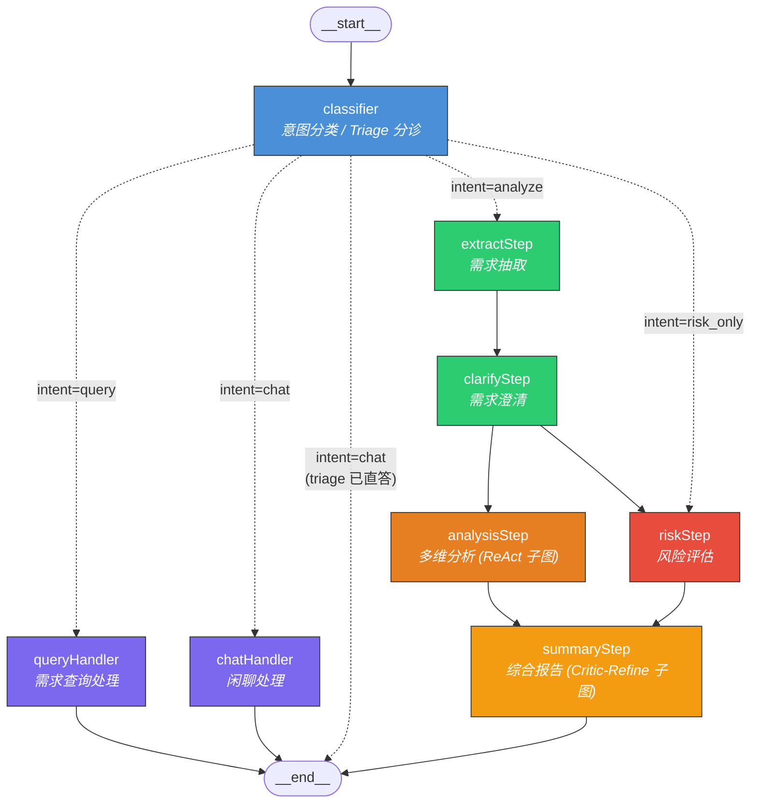
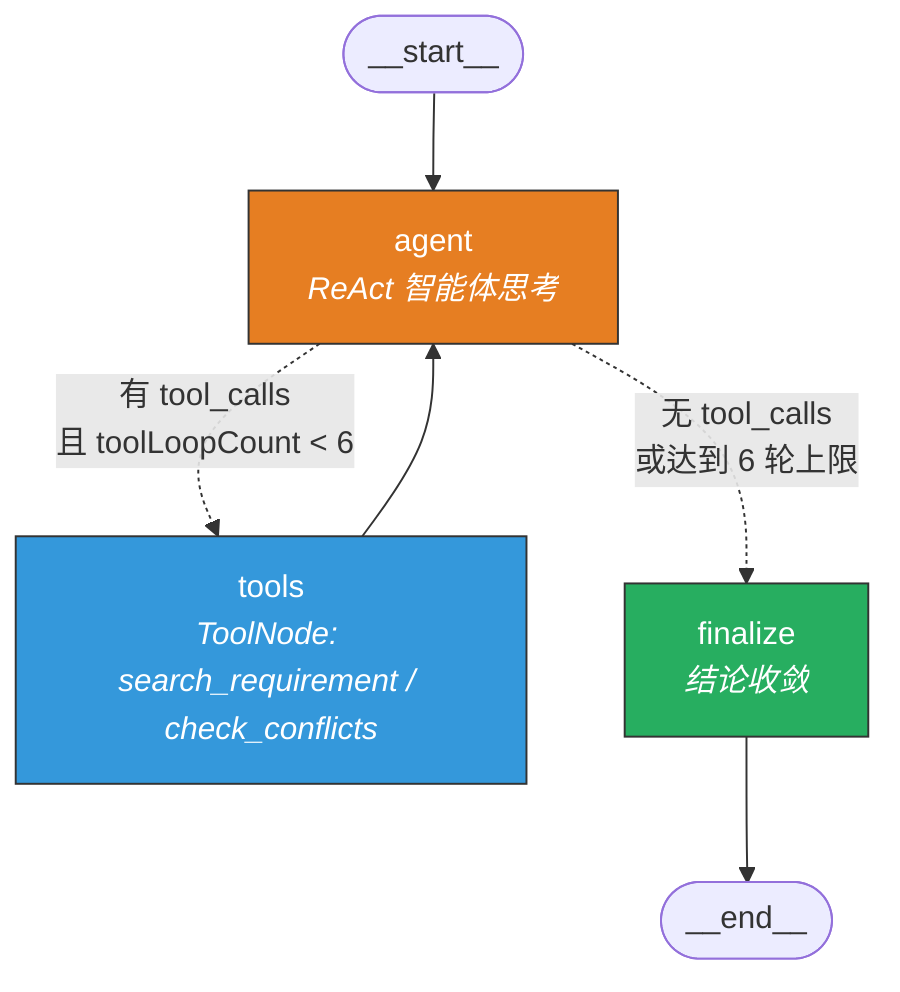
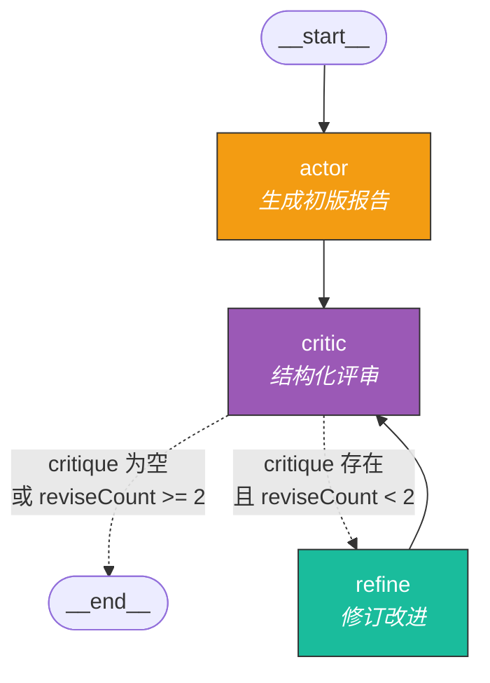
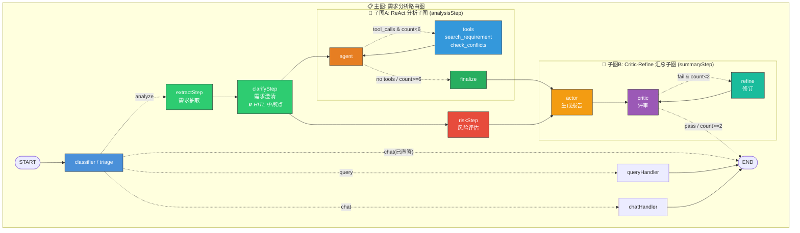

# 需求分析 Graph 拓扑结构分析

基于 [requirement-analysis-graph.ts](file:///d:/ZSP/Study/Ai%20Agent/agentic-fullstack-monorepo/services/chat/src/llm/graph/requirement-analysis-graph.ts) 和 [requirement-analysis-graph.spec.ts](file:///d:/ZSP/Study/Ai%20Agent/agentic-fullstack-monorepo/services/chat/test/requirement-analysis-graph.spec.ts) 的完整分析。

整个系统由 **1 个主图 + 2 个子图** 组成，采用嵌套 StateGraph 架构。

---

## 1. 主图：需求分析路由图 (`createAnalysisGraph`)

> 源码位置：[L1260-L1340](file:///d:/ZSP/Study/Ai%20Agent/agentic-fullstack-monorepo/services/chat/src/llm/graph/requirement-analysis-graph.ts#L1260-L1340)

入口节点根据配置可选 `classifier`（第八章）或 `triage`（第九章 9.4 Handoff 分诊）。

**核心路由逻辑** ([`routeByIntent`](file:///d:/ZSP/Study/Ai%20Agent/agentic-fullstack-monorepo/services/chat/src/llm/graph/requirement-analysis-graph.ts#L1216-L1231))：
- `chat` → 若 triage 已直答则短路 `END`，否则走 `chatHandler`
- `query` → `queryHandler`
- `analyze`（默认） → `extractStep` → 分析链路
- `risk_only` → `riskStep`

**关键特性**：`clarifyStep` 后 `analysisStep` 和 `riskStep` **并行分叉**，两者都汇聚到 `summaryStep`。

---

## 2. 子图 A：ReAct 分析子图 (`createAnalysisSubGraph`)

> 源码位置：[L845-L863](file:///d:/ZSP/Study/Ai%20Agent/agentic-fullstack-monorepo/services/chat/src/llm/graph/requirement-analysis-graph.ts#L845-L863)

挂载在主图的 `analysisStep` 节点上。采用经典 ReAct 模式：Agent → Tools → Agent 循环，通过 [`shouldCallTools`](file:///d:/ZSP/Study/Ai%20Agent/agentic-fullstack-monorepo/services/chat/src/llm/graph/requirement-analysis-graph.ts#L764-L783) 条件路由控制。

**防死循环机制**：`toolLoopCount >= 6` 时强制跳转 `finalize`。

**工具集**（[`analysisTools`](file:///d:/ZSP/Study/Ai%20Agent/agentic-fullstack-monorepo/services/chat/src/llm/graph/requirement-analysis-graph.ts#L28-L31)）：
- `search_requirement` — 按需求编号检索已有需求
- `check_conflicts` — 检测架构冲突

---

## 3. 子图 B：Critic-Refine 汇总子图 (`createSummarySubGraph`)

> 源码位置：[L1139-L1169](file:///d:/ZSP/Study/Ai%20Agent/agentic-fullstack-monorepo/services/chat/src/llm/graph/requirement-analysis-graph.ts#L1139-L1169)

挂载在主图的 `summaryStep` 节点上。采用"生成 → 评审 → 修订"循环模式，通过 [`shouldRefine`](file:///d:/ZSP/Study/Ai%20Agent/agentic-fullstack-monorepo/services/chat/src/llm/graph/requirement-analysis-graph.ts#L1114-L1129) 条件路由控制。

**防死循环机制**：`reviseCount >= 2` 时强制终止。

---

## 4. 完整嵌套总览图

将三层图合并为一张全景拓扑图：

---

## 5. State 通道一览

| 通道 | 类型 | 用途 |
|------|------|------|
| `messages` | `BaseMessage[]` | 对话历史（MessagesAnnotation） |
| `intent` | `'analyze'\|'query'\|'chat'\|'risk_only'` | 意图分类结果 |
| `extracted` | `ExtractedRequirement` | 结构化抽取结果 |
| `clarified` | `ClarificationResult` | 澄清诊断结果 |
| `analysis` / `analysisResult` | `string` | 多维分析报告 |
| `risk` / `riskResult` | `string` | 风险评估报告 |
| `summary` | `string` | 最终综合报告 |
| `toolLoopCount` | `number` | ReAct 工具调用轮次（上限 6） |
| `critique` | `string` | Critic 评审意见 |
| `reviseCount` | `number` | 修订次数（上限 2） |
| `summaryDraft` | `string` | 汇总草稿 |
| `queryResponse` | `string` | 查询分支响应 |
| `chatResponse` | `string` | 闲聊分支响应 |
| `steps` | `string[]` | 执行路径追踪 |

## 6. 防护机制总结

| 机制 | 位置 | 阈值 |
|------|------|------|
| ReAct 工具循环硬上限 | `shouldCallTools` | `toolLoopCount >= 6` 强制 finalize |
| Critic-Refine 修订硬上限 | `shouldRefine` | `reviseCount >= 2` 强制 END |
| 意图分类降级兜底 | `fallbackIntentClassifier` | LLM 异常时正则规则引擎兜底 |
| 分析结论安全降级 | `finalizeNode` | AI 回复为空时生成模板报告 |
| Critic 评审降级 | `criticNode` catch | 结构化输出异常时基于关键词检查 |
